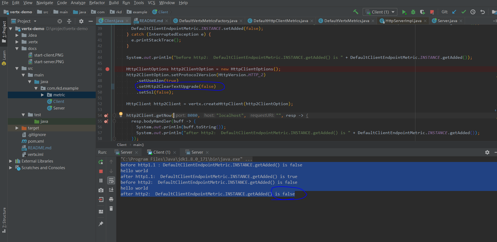

# io.vertx.core.spi.metrics.HttpClientMetrics#endpointConnected is not invoked for Http2 client

* start server


* start client 




the main logic is show as bellow :

```java

public class DefaultHttpClientMetrics implements
    HttpClientMetrics<Object, Object, Object, DefaultClientEndpointMetric, Object> {
  
  @Override
  public void endpointConnected(DefaultClientEndpointMetric endpointMetric, Object socketMetric) {
  // when invoke this method, I will set the property "added" to true
    endpointMetric.setAdded(true);
  }
}  
```

the result is show as below:

you can see that http2 client will not invoke the method `endpointConnected` 

```
before http1.1 : DefaultClientEndpointMetric.INSTANCE.getAdded() is false
hello world
after http1.1:  DefaultClientEndpointMetric.INSTANCE.getAdded() is true
before http2:  DefaultClientEndpointMetric.INSTANCE.getAdded() is false
hello world
after http2:  DefaultClientEndpointMetric.INSTANCE.getAdded() is false
```
